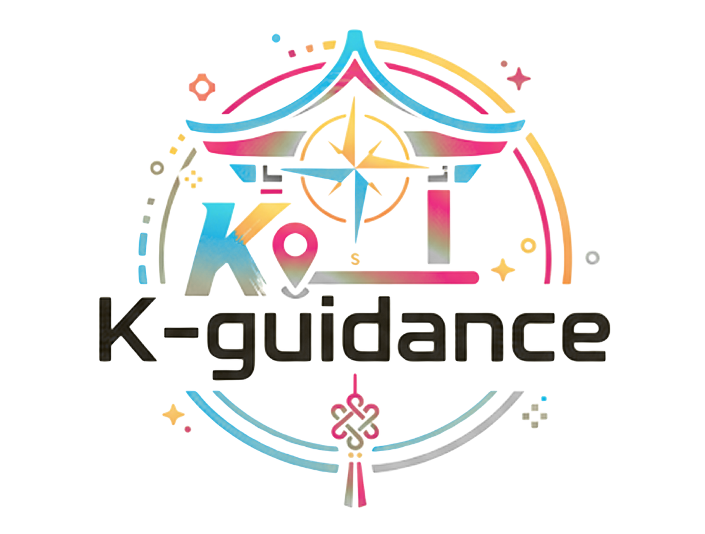
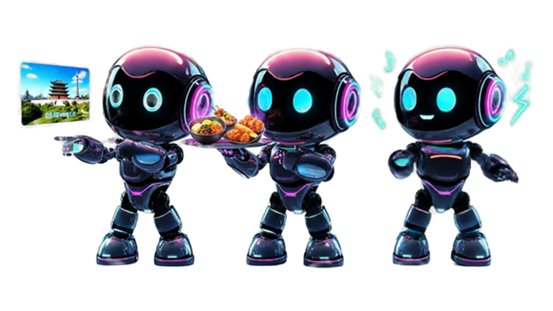

# K-Guidence

  

  

## 프로젝트 소개

K-Guidence는 서울 여행을 위한 AI 기반 여행 도우미 애플리케이션입니다.

## 주요 기능
- 한국 명소, 음식점, K-Drama를 소개 해주는 쳇봇
- 챗봇과 대화하여 지도 마커로 표시해주고 여행지에 추가
- 자신의 일정계획에 따른 거리 시각화 및 교통편 계산
- K-content 관련 장소를 소개해주고 가까운 음식점 추천
- 사용자의 여행지스타일에 따라서 K-Drama 관련 장소 추천

## 기술 스택

- **Frontend**: React
- **Backend**: FastAPI
- **Database**: MariaDB, Qdrant Vector DB
- **AI**: OpenAI API
- **release** : Docker, AWS   

## 팀원 소개

<table>
  <tr>
    <td align="center"><b>김다은</b></td>
    <td align="center"><b>백승범</b></td>
    <td align="center"><b>한지훈</b></td>
  </tr>
  <tr>
    <td align="center">
      
    </td>
    <td align="center">
      
    </td>
    <td align="center">
      
    </td>
  </tr>
</table>

## 시스템 아키텍쳐
 

  

## 요구사항 정의서 

### 🔐 회원 관리
- **회원가입**: 이메일, 비밀번호, 이름을 통한 회원가입
- **로그인**: 가입한 계정 정보로 서비스 접근
- **아이디/비밀번호 찾기**: 이메일 인증을 통한 계정 정보 찾기
- **로그아웃**: 세션 종료 기능

### 📊 사용자 대시보드
- **대시보드 구성**: 북마크, 아이디어
- **항목 관리**: 북마크, 아이디어(경로), 워드클라우드 삭제 및 수정
- **북마크 저장**: 북마크 항목은 사용자 계정과 연동하여 저장

### 💬 AI 챗봇
- **툴팁 기능**: 추천 스크립트 선택 가능
- **자연어 처리**: 자연어 입력 요청 처리 및 오타/표현 차이 인식
- **추가 정보 안내**: 인근 행사/공연, 맛집, 숙박, 관광명소 정보 제공

### 🗺️ 지도 시각화
- **경로 표시**: 챗봇 입력 시 지도에 경로 및 장소 표시
- **마커 기능**: 지도 마커 클릭 시 장소 및 위치 정보 표시

### 🗺️ 맞춤형 추천
- **일정/장소 추천**: 선호도, 이동수단 정보를 반영한 장소 추천
- **자동 업데이트**: 필요 시 추천 일정 자동 업데이트

### 🔖 북마크 & 아이디어
- **장소 관리**: 경로 내 장소 저장, 삭제, 수정
- **경로 저장**: 챗봇 제공 경로를 '아이디어'에 저장
- **경로 수정**: 저장된 경로 삭제 및 수정

### 🔍 장소 검색
- **검색 기능**: 맛집, 관광명소, 숙박, 행사 등 검색
- **장소 저장**: 검색한 장소를 북마크 및 대시보드에 저장
- **상세 정보**: 콘텐츠 클릭 시 관련 정보 열람 및 북마크/아이디어 추가
- **북마크 관리**: 저장된 콘텐츠 열람 및 삭제

## 개발 일정

### 📋 Sprint 1
**기획 및 설계**
- 기획 및 요구사항 정의
- 프로젝트 설계
- 데이터 탐색

### 🗄️ Sprint 2
**데이터 및 인프라 구축**
- 데이터 수집 및 전처리
- DB 적재
- Docker 환경 설정

### ⚙️ Sprint 3
**핵심 기능 개발**
- 백엔드 아키텍처 세팅
- 프론트엔드 개발
- 챗팅시스템 개발

### 🎬 Sprint 4
**서비스 확장**
- K-Media 탭 서비스 개발
- 사용자 대시보드 개발

### 🚀 Sprint 5
**고도화 및 배포**
- 추천 시스템 개발
- AWS 배포
